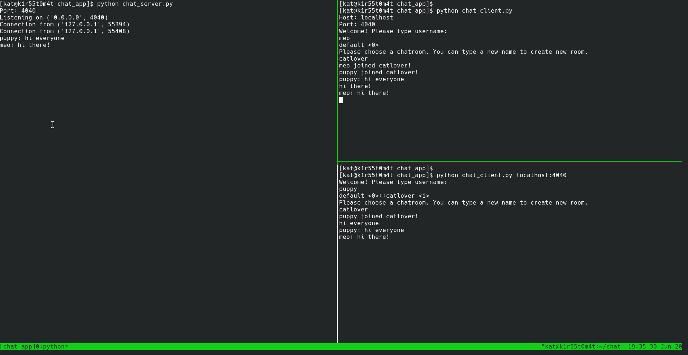

24th Jun 2020:

___
30th Jun 2020:
I just added username and chatroom feature. It works like this: when a new user joins, he will see a list of available chatrooms.
There is a default chatroom for users who don't know which room to join.

